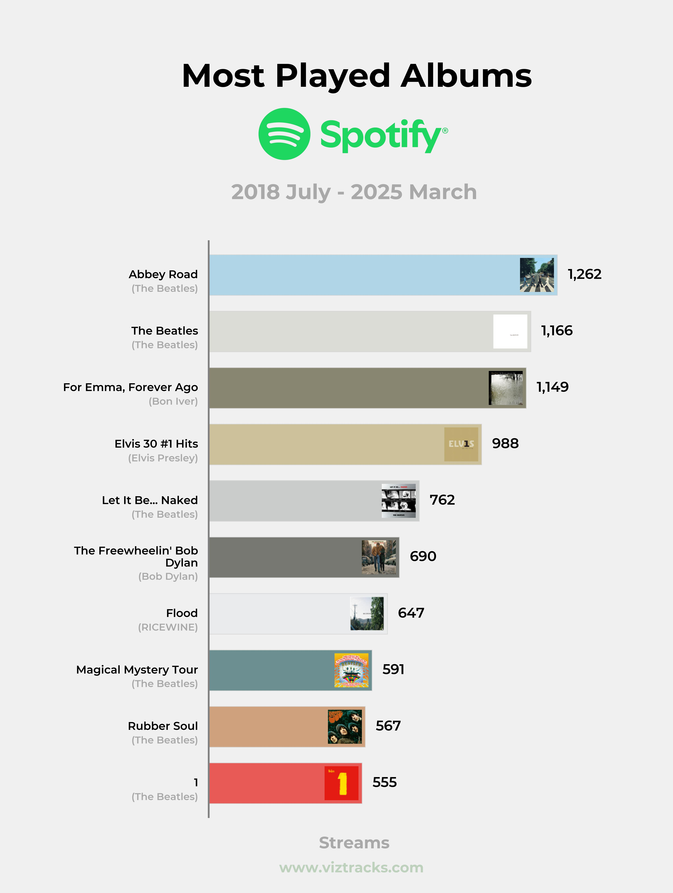

# VizTracks App
Welcome to the VizTracks App!

This web app allows you to visualize your Spotify data in a fun and interactive way.

The user has the ability to select how many items they want to visualize, and whether it's artists, songs, or albums. The app generates both static images and animations! 🎵🎵

Top 5 Artists you've ever listened to? Top 10 Songs? Top 3 Albums you've listened to the most this decade? The app can visualize all of this data and allow you to share it with your friends in a social media friendly format! 

The web app can be accessed at: [www.viztracks.com](https://www.viztracks.com/)

# Example Visualizations

    
    

## How to use
1. **Upload your Spotify data**: follow the instructions on the web app
2. **Select Data Type**: Choose whether you want to visualize your favorite artists, songs, or albums.
3. **Generate Image and Animation**: Click the buttons to create your Visualisations.
4. **Share**: Download the generated images and animations to share with your friends!

## Features
- **Animations**: Generate animations that showcase your favorite artists, songs, or albums.
- **User-Friendly Interface**: Easy to use with a clean and modern design.
- **Shareable**: Download your Visualisations and animations to share on social media or with friends.
- **Open Source**: Built with Python and Streamlit, the code is available for anyone to contribute or modify.
- **Third-Party Tool**: Uses Spotify data but is not affiliated with or endorsed by Spotify.
- **Privacy Focused**: Your Spotify data is processed locally, and no personal information is stored or shared.
- **Feedback Mechanism**: Users can provide feedback and suggestions for new features or improvements.

## Libraries/Tools Used
- **Frontend**: Streamlit, HTML/CSS.
- **Backend**: Flask, Requests
- **Data/Processing**: DuckDB, Polars, Pandas, NumPy.
- **Visualization**: Matplotlib, colorthief.
- **Encoding**: FFmpeg (NVENC), PyTurboJPEG.
- **Integrations**: Supabase, Spotipy.
- **Infrastructure/Deployment**: Docker, Fly.io, Gunicorn

## Behind the Scenes

1. **Full-Stack Architecture**  
   The app is a full-stack pipeline that pairs a **Streamlit frontend** with a **Flask backend** (served via **Gunicorn**) to transform a user’s Spotify ZIP export into static and animated visuals.  

2. **Session-Scoped Data Processing**  
   Uploaded files are processed into a **per-session DuckDB database**, which is then queried to produce a **time-indexed dataset** with cumulative metrics for the selected artists, tracks, or albums. Each session is isolated via a unique `session_id`, ensuring user data remains separate and secure while keeping the UI responsive.  

3. **Frame Rendering**  
   **Matplotlib** renders bar-race frames using **precomputed aggregates** and **cached artwork**, including dominant colours extracted from album covers. This design minimizes Python-side overhead and avoids large in-memory artifacts on the web tier.  

4. **GPU-Accelerated Encoding**  
   The generated frames are passed to a dedicated **encoder service** that runs **FFmpeg with NVENC** on a **GPU-backed instance**. Hardware encoding significantly reduces time-to-video compared to CPU-based rendering, especially at higher resolutions and frame counts.  

5. **Frame Streaming for Efficiency**  
   Instead of sending one large JSON or binary payload, frames are **streamed** to the encoder in real time. This approach keeps memory usage steady, pipelines frames as they’re generated, and avoids hitting platform request-size limits. Streaming operates well within **Fly.io’s** constraints, resulting in faster, smoother, and more reliable end-to-end renders.  

 
Please share the app with your friends and family, and let them know about this fun way to visualize their Spotify data!

 
 
*Disclaimer: Spotify is a registered trademark of Spotify AB. This app is a third-party tool that uses Spotify data and is not affiliated with or endorsed by Spotify*

 
 

Created by [Maxwell Bernard](https://www.linkedin.com/in/maxwell-bernard/)
October 2025
